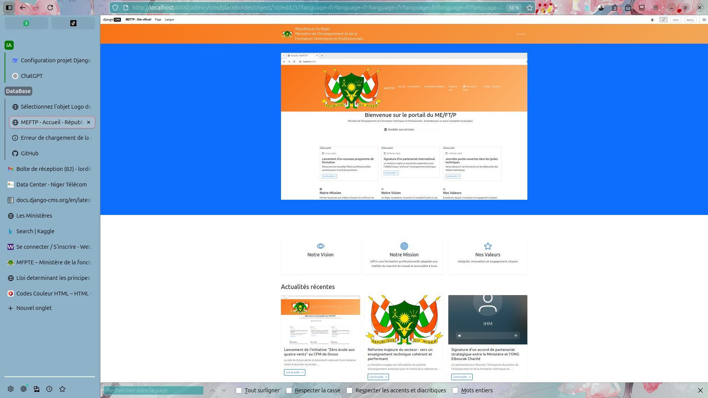

Présentation du projet

# ME/FT/P - Site Officiel du Ministère de l'Enseignement et la Formation Techniques et Professionnels du Niger

Site web institutionnel développé avec django CMS, offrant une plateforme moderne pour la communication et les services en ligne du ministère.

## 🎯 Aperçu

## ✨ Fonctionnalités

- **Gestion de contenu complète** via interface d'administration intuitive
- **Design responsive** avec Bootstrap 5 pour mobile, tablette et desktop
- **Interface multilingue** (Français/Anglais)
- **Optimisation SEO** intégrée (meta tags, sitemaps)
- **Formulaire de contact** sécurisé avec Akismet
- **Gestion de médias** (images, documents) avec django-filer
- **Système de cache** avec Redis pour des performances optimales
- **Menu dynamique** personnalisable via l'interface d'administration
- **Prêt pour la production** avec Gunicorn et Nginx

## 📸 Captures d'écran

## 🏗️ Structure du projet

meftp_web/
├── config/ # Configuration Django
├── core/ # Application principale
├── templates/ # Templates HTML
├── static/ # Fichiers statiques
├── media/ # Fichiers uploadés
└── requirements.txt # Dépendances Python
text

## 🚀 Déploiement rapide

Pour une installation rapide, consultez le guide correspondant à votre système :

- [🐧 Installation sur Linux](INSTALLATION_LINUX.md)
- [🪟 Installation sur Windows](INSTALLATION_WINDOWS.md)
- [🍏 Installation sur macOS](INSTALLATION_MAC.md)

## 📦 Technologies utilisées

- **Backend** : Django 4.2.7, django CMS 4.1.2
- **Base de données** : PostgreSQL
- **Cache** : Redis
- **Frontend** : Bootstrap 5, HTML5, CSS3
- **Serveur** : Gunicorn, Nginx
- **Sécurité** : HTTPS, CSRF, XSS protection

## 🤝 Contribution

Les contributions sont les bienvenues ! Consultez notre guide de contribution.

## 📝 License

Ce projet est sous licence MIT.

## 📞 Contact

Ministère de l'Enseignement et la Formation Techniques et Professionnels  
Email: [contact@meftp.gouv.ne](mailto:contact@meftp.gouv.ne)  
Site: [www.meftp.gouv.ne](https://www.meftp.gouv.ne)

---

**Documentation complète** : [Wiki du projet](https://github.com/votre-compte/meftp_web/wiki)
